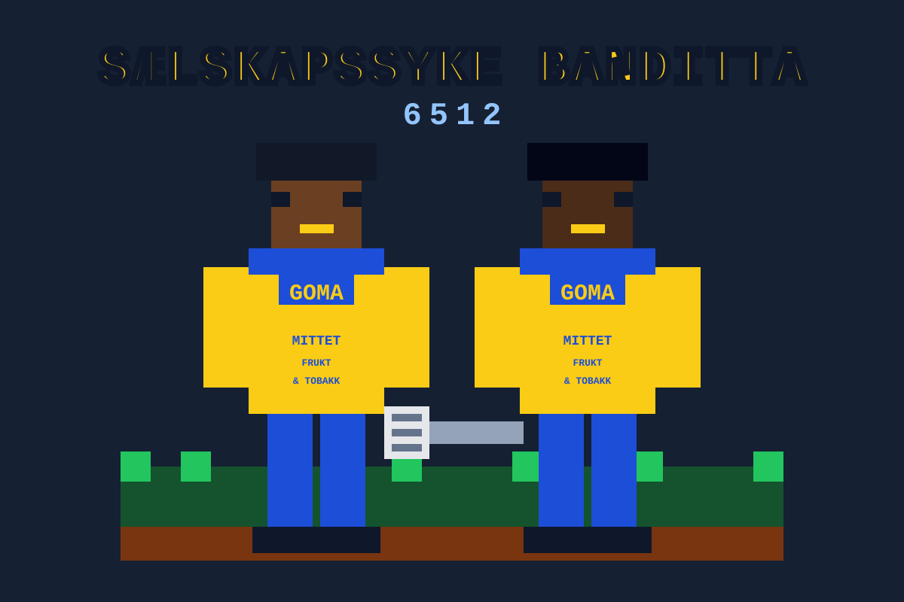

# Sælskapssyke Banditta

The official jukebox for Bandittan — straight outta **6512**, rep'n the **Væstkystn**.
GOMA stand up. Brought to you by **MITTET FRUKT & TOBAKK**.



## What it does

- Streams the SB catalog right in your browser — no install, no signup, no nonsense. Aight!
- Auto-rolls to the next track when one fades out
- Right-click any joint to grab the mp3 for the road
- Loops back to the top when the last track drops
- Mobile-friendly — runs on whatever device you got

## Stack

- HTML5 · CSS3 · vanilla JavaScript
- HTML5 Audio API doin' the heavy lift
- No frameworks, no build step, no dependencies

## Get it spinning

```bash
git clone https://github.com/papptigrn/selskapssykebanditta.git
cd selskapssykebanditta
# pop index.html in your browser, that's it
```

## How to ride

- Click a track in the playlist to play
- Right-click → **Download** to keep one for the road
- Tracks roll one after the other; when the last one fades, the playlist starts over

## The roster

**Sælskapssyke Banditta**
- Alt Eller Ingenting *(feat. MC Frokost)*
- Væstkyst MC
- Rar Kåtsekk
- Kor Vi Kommer Fra
- Bandittan
- 6512

**Balliztic**
- Rennesteinspoesi *(feat. Zubztance & Gitarduden)*
- Ligg Lavt I Terrenget *(feat. MC Frokost)*

## Layout

```
SB/
├── index.html      # the player
├── styles.css      # styling
├── scripts.js      # playlist + audio logic
├── logo.svg        # the GOMA logo
├── mp3/            # the tracks
└── README.md       # you are here
```

## License

MIT — take it, flip it, just don't bite the bars.
Check it out live @ [selskapssyke.banditta.no](https://selskapssyke.banditta.no)
